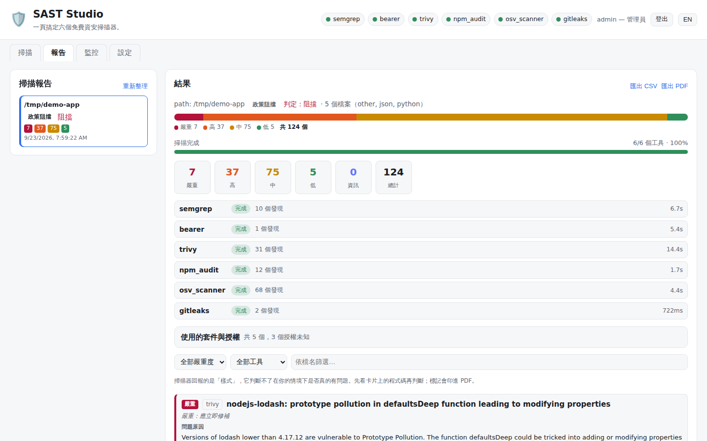
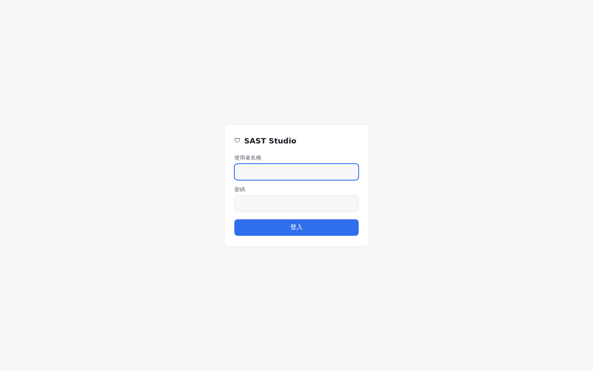
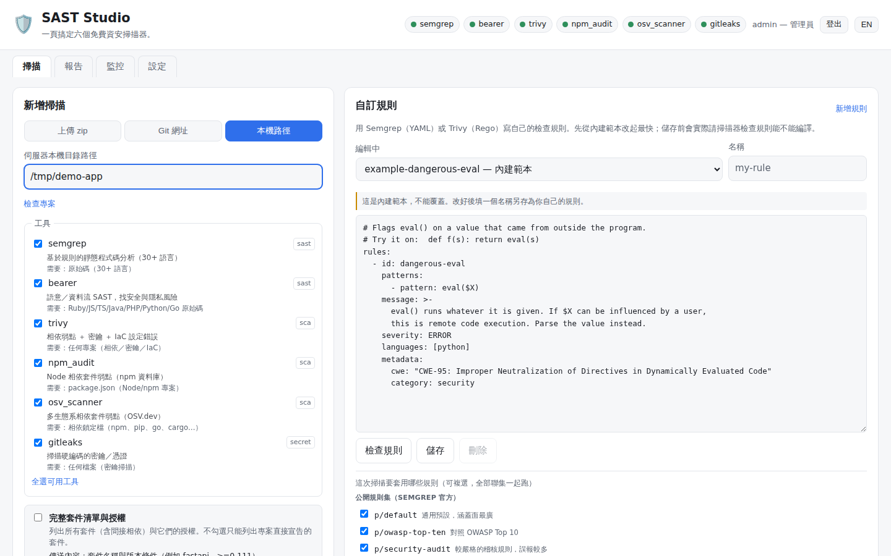
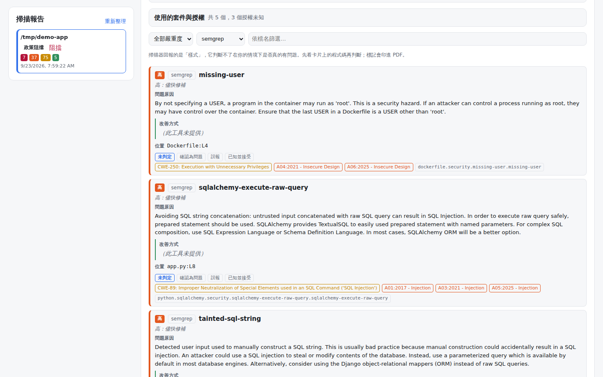
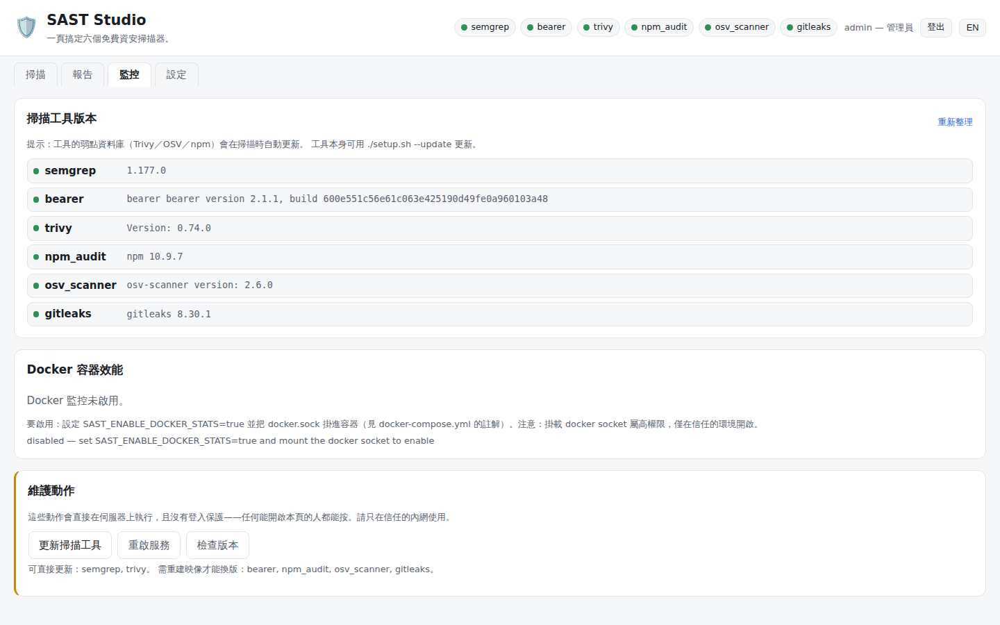
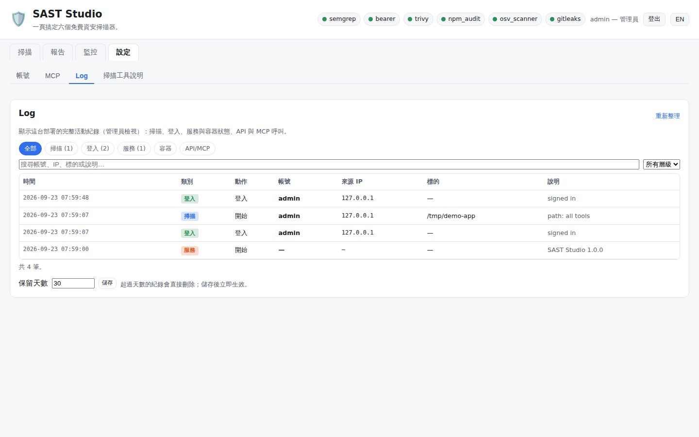
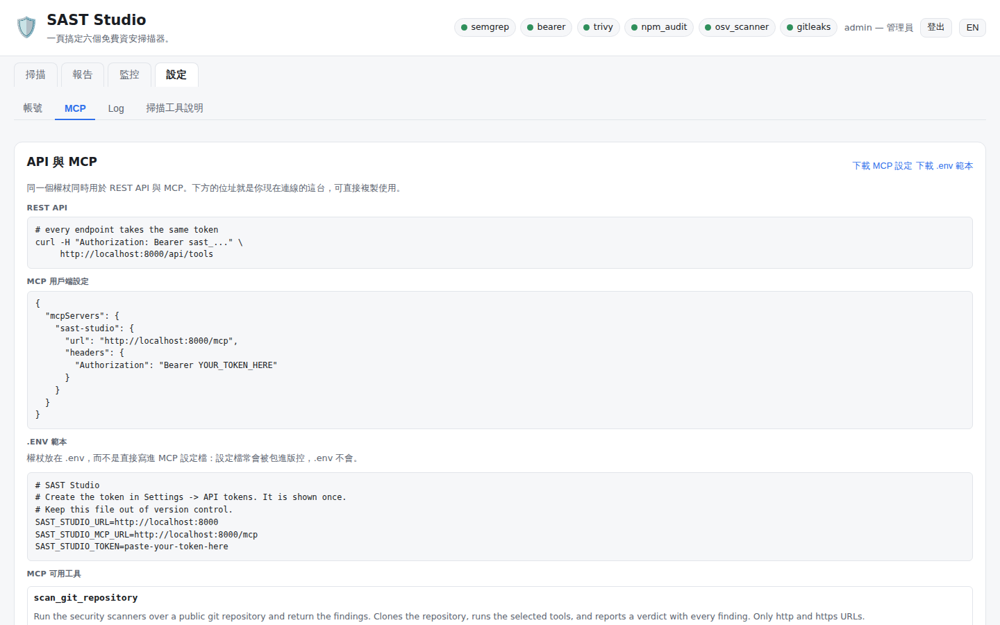

# SAST Studio

> [English README](README.en.md)

**一頁搞定六個免費資安掃描器。** 指向一份程式碼（上傳 zip、Git 網址或伺服器本機路徑），
SAST Studio 會同時跑 **Semgrep、Bearer、Trivy、npm audit、OSV-Scanner、Gitleaks**，
再把所有發現彙整成**一張依嚴重度排序的報表**，並給出「通過／需人員審查／不可上線」的判定。

不必分別安裝每個工具、記它們的參數、或讀六種不同格式的輸出；六個工具全部免費，不需付費授權。



---

## 目錄

1. [畫面導覽](#畫面導覽)
2. [整合的掃描軟體](#整合的掃描軟體)
3. [資料會傳到哪裡（隱私與對外連線）](#資料會傳到哪裡隱私與對外連線)
4. [架構](#架構)
5. [快速開始](#快速開始)
6. [部署與更新維護腳本](#部署與更新維護腳本)
7. [使用方式](#使用方式)
8. [REST API](#rest-api)
9. [MCP（讓 AI 助理呼叫）](#mcp讓-ai-助理呼叫)
10. [帳號與權限](#帳號與權限)
11. [設定（環境變數）](#設定環境變數)
12. [工具本身的安全](#工具本身的安全)
13. [開發與測試](#開發與測試)

---

## 畫面導覽

以下截圖皆為實際執行畫面：用內附六個掃描器掃描一個刻意寫壞的示範專案
（含 SQL injection、命令注入、硬編碼密鑰、老舊相依套件）。

| 登入 | 掃描分頁 |
|---|---|
|  |  |
| **報告分頁：發現卡片** | **監控分頁** |
|  |  |
| **設定 → Log（活動紀錄）** | **設定 → MCP** |
|  |  |

| 分頁 | 功能 |
|---|---|
| **掃描** | 選來源（上傳 zip／Git 網址／本機路徑）、勾選工具與 Semgrep 規則集、撰寫自訂規則，按下開始掃描 |
| **報告** | 左邊是歷次掃描清單，右邊是選中那份的判定、嚴重度分佈、各工具結果、每筆發現卡片；可匯出 CSV 與 PDF |
| **監控** | 掃描器版本、Docker 容器效能與資源評估、維護動作（更新掃描器、重啟服務） |
| **設定** | 帳號、API 權杖、密碼原則、MCP 設定、活動紀錄（Log）、掃描工具說明 |

右上角可一鍵切換**中文 / English**（選擇會被記住）。

---

## 整合的掃描軟體

| 工具 | 類型 | 做什麼 | 需要什麼才會跑 | 授權 |
|------|------|--------|----------------|------|
| **Semgrep** | SAST | 以規則比對原始碼（30+ 語言），找注入、不安全 API 等 | 原始碼 | LGPL-2.1（引擎）；規則集依 Semgrep 規則授權 |
| **Bearer** | SAST | 語意／資料流分析，找安全與隱私（個資流向）風險 | Ruby／JS／TS／Java／PHP／Python／Go 原始碼 | Elastic License 2.0 |
| **Trivy** | SCA／密鑰／IaC | 相依套件弱點 ＋ 硬編碼密鑰 ＋ Dockerfile／K8s／Terraform 設定錯誤 | 任何專案 | Apache-2.0 |
| **npm audit** | SCA | Node 相依套件弱點（npm 官方資料庫） | `package.json`（沒有 lockfile 會自動產生） | Artistic-2.0（npm） |
| **OSV-Scanner** | SCA | 多生態系相依套件比對 OSV.dev 弱點資料庫 | 相依鎖定檔（npm、pip、go、cargo…） | Apache-2.0 |
| **Gitleaks** | 密鑰 | 掃描硬編碼的密鑰／憑證 | 任何檔案 | MIT |

目前釘住的版本（`Dockerfile`、`scripts/install-tools.sh`、`scripts/fetch-vendor.sh` 三處一致）：
Trivy **0.74.0**、OSV-Scanner **2.6.0**、Gitleaks **8.30.1**；Semgrep 以 pip 安裝最新版；
Bearer 走官方安裝腳本（CI 內釘 2.1.1 並驗 SHA-256）。

> **為什麼不用 CodeQL？** 它的 CLI 只對開源／研究免費，掃描私有程式碼需要付費的
> GitHub Advanced Security 授權。本專案改用 **Bearer**（語意 SAST）與 **Trivy**（補上 IaC 設定錯誤掃描）
> 零成本取代。

**優雅降級**：沒安裝的工具會標示「未安裝」並附安裝指引；不適用的工具（例如沒有 `package.json` 時的
npm audit）會標示「不適用」與原因——掃描照樣跑其他工具。

---

## 資料會傳到哪裡（隱私與對外連線）

**結論：你的原始碼不會被上傳到任何第三方。** 所有掃描都在本機（或容器內）執行，
上傳的 zip／clone 下來的程式碼只放在該次掃描的獨立工作區，掃描結束即刪除
（除非設了 `SAST_KEEP_WORKSPACES=true`）。

但有幾個工具需要連網**下載規則或弱點資料庫**、或**查詢套件是否有已知漏洞**。
會離開主機的只有下表列出的內容：

| 工具 | 連到哪裡 | 傳出的資料 | 會不會傳原始碼 | 本專案的設定 |
|---|---|---|---|---|
| **Semgrep** | `semgrep.dev`（規則登錄庫） | 要下載的規則集名稱（如 `p/default`） | **不會** | 一律加 `--metrics=off`（關閉使用統計）與 `--disable-version-check`（不檢查新版） |
| **Bearer** | Bearer 官方伺服器 | 啟動時的版本檢查請求 | **不會**（本專案未設定 `--api-key`，不會上傳到 Bearer Cloud） | 未加 `--disable-version-check`；若要完全離線可設環境變數 `BEARER_DISABLE_VERSION_CHECK=true` |
| **Trivy** | `mirror.gcr.io`／`ghcr.io`（弱點 DB、設定檢查規則包）；`check.trivy.dev`（版本檢查＋匿名使用統計） | 下載 DB 時只是單純下載；版本檢查會帶 Trivy 版本、指令與匿名安裝 ID（官方說明不含檔案路徑與掃描結果） | **不會**——弱點比對在本機完成，套件清單不外傳 | 使用預設值；要關閉版本檢查與統計，可在指令加 `--skip-version-check --disable-telemetry` |
| **npm audit** | `registry.npmjs.org` | **相依套件的名稱與版本**（整棵相依樹）；沒有 lockfile 時會先用 `npm install --package-lock-only --ignore-scripts` 產生，這一步也會向 registry 查詢套件資訊 | **不會** | `--ignore-scripts`：不執行任何套件的安裝腳本 |
| **OSV-Scanner** | `api.osv.dev`；勾「完整套件清單與授權」時另查 `deps.dev` | **相依套件的名稱、版本、生態系**（git 相依可能帶 commit hash） | **不會** | 預設只查弱點；授權查詢需逐次勾選或設 `SAST_OSV_FULL_INVENTORY=true` |
| **Gitleaks** | 無 | 無（完全離線） | **不會** | 找到的密鑰在送到 API／瀏覽器前先遮罩 |

其他會連網的動作：

| 動作 | 連到哪裡 | 說明 |
|---|---|---|
| Git 網址掃描 | 你給的 Git 主機 | 只允許 `http`/`https`、depth-1、不互動、有 timeout；預設拒絕內網位址（`SAST_ALLOW_INTERNAL_GIT_HOSTS`） |
| 監控分頁「檢查版本」 | GitHub Releases API | 只查掃描器是否有新版，不帶任何掃描資料 |
| 更新掃描器／建置映像 | PyPI、GitHub Releases、Bearer／Trivy 安裝腳本 | 只下載工具本體，二進位檔會驗 checksum |

> **敏感專案須知**：npm audit 與 OSV-Scanner 會讓外部服務知道「這個專案用了哪些套件與版本」。
> 若連這個都不能外流，請在掃描時不要勾選這兩個工具，或在離線環境使用（它們會顯示錯誤，其餘工具照常執行）。
> 要讓 Semgrep 離線，把 `SAST_SEMGREP_RULESETS` 設為本機規則檔路徑，並在掃描時不勾選官方規則集
> （官方規則集 `p/...` 一定要從 semgrep.dev 下載）。

---

## 架構

```
瀏覽器 ──► nginx（反向代理）──► FastAPI ──► Orchestrator ──► 6 個 Adapter ──► 掃描工具
            :8080  →  :8000       REST API     （工作管理）    （一工具一個）
                                   /mcp        記憶體工作佇列
                                   SQLite：帳號、權杖、判定標記、活動紀錄
```

- **nginx 反向代理**：Docker 部署時 nginx 是唯一對外入口（`:8080`），後端 `:8000` 不對主機公開。上傳上限 200 MB。
- **Adapter 模式**：每個工具一個 adapter，只做三件事——*偵測可用性*、*執行*、*把輸出正規化*成統一的
  `Finding` 格式。Orchestrator 不需要理解任何工具的原生格式。
- **專案盤點 ＋ 適用性判斷**：每次掃描回報檔案數、大小與語言分佈，並說明哪些工具不適用、為什麼。
- **簡單至上**：記憶體工作佇列、HTTP 輪詢看進度、無框架的原生 JS 前端，沒有建置步驟。
- **資料保存**：

  | 資料 | 存在哪裡 | 重建映像／更新後 |
  |---|---|---|
  | 帳號、API 權杖、判定標記、活動紀錄 | Docker volume `sast-accounts`（SQLite） | **保留** |
  | 自訂規則 | Docker volume `sast-rules` | **保留** |
  | 掃描工作區 | Docker volume `sast-workspaces`（掃完即清） | 保留（通常是空的） |
  | 掃描記錄（報告分頁的清單） | **記憶體**，最多保留 100 筆 | **清空** |

---

## 快速開始

先把程式碼拿下來：

```bash
git clone https://github.com/zzx789654/sast-.git
cd sast-
```

### 我該用哪一個指令？

| 情境 | 指令 |
|---|---|
| **第一次**，還沒裝 Docker（Ubuntu） | `./setup.sh --docker` |
| **第一次**，已經有 Docker | `./scripts/deploy.sh` |
| **更新**掃描工具（連同程式） | `./setup.sh --update` |
| 只改了程式碼，工具不變 | `./scripts/deploy.sh` |
| 新版出問題，要退回上一版 | `./scripts/deploy.sh --rollback` |
| 不用 Docker，直接跑在主機（Ubuntu） | `./setup.sh` 然後 `./setup.sh --run` |
| 忘記管理員密碼 | `./scripts/reset-password.sh` |

部署完成後開啟 **http://你的主機:8080**。第一次部署時，`deploy.sh` 會在最後印出自動產生的
管理員帳號密碼（只顯示這一次），請當下記下來，登入後到**設定**分頁更改。

第一天之後常用的只有兩個：

```bash
./setup.sh --update      # 完整更新：下載到本機 → 重建映像 → 切換容器
./scripts/deploy.sh      # 部署程式變更：拉原始碼 → 建置 → 切換
```

兩者都可以重複執行、都會保留舊映像可以回退，而且**都不會動到你的帳號與自訂規則**——
這些存在獨立的 Docker volume，重建映像不會重建它們。**更新不需要重設任何密碼。**
（掃描記錄例外：它存在記憶體裡，切換容器就會清空。）

---

## 部署與更新維護腳本

專案內共有五支給人執行的腳本：

| 腳本 | 用途 | 何時用 |
|---|---|---|
| `setup.sh` | 一鍵安裝（主機或 Docker）、一鍵更新 | 第一次安裝；要更新掃描器版本時 |
| `scripts/deploy.sh` | 建置新映像並切換容器、健康檢查、回退 | 每次程式更新；出問題時回退 |
| `scripts/reset-password.sh` | 在主機上重設帳號密碼 | 忘記密碼、帳號被鎖 |
| `scripts/fetch-vendor.sh` | 把掃描器二進位預先下載到 `./vendor` | 由上面兩支自動呼叫；網路慢時可單獨先跑 |
| `scripts/install-tools.sh` | 把掃描器安裝到主機 | 由 `setup.sh` 自動呼叫；手動安裝時使用 |

另有 `scripts/docker-gid.sh` 由部署腳本自動呼叫（偵測主機 docker 群組 ID 寫入 `.env`，讓監控分頁能讀容器效能），一般不需手動執行。

### `setup.sh` — 安裝與更新

```bash
./setup.sh [選項]
```

| 選項 | 做什麼 |
|---|---|
| （無） | **主機完整安裝**：檢查並用 apt 補齊 git／curl／Node.js／npm／python3-venv → 建立 `.venv` → 安裝 Python 相依 → 安裝六個掃描器 → 跑測試驗證 → 列出各工具是否可用 |
| `--run` | 安裝完直接以 `uvicorn` 在 `http://localhost:8000` 啟動服務 |
| `--docker` | **Docker 安裝**：若沒有 Docker 就從 Docker 官方 apt 來源安裝 Docker Engine ＋ Compose → 偵測 docker 群組 ID → `docker compose up --build -d`，完成後開 `http://localhost:8080` |
| `--update` | **更新**（詳見下方） |
| `--no-tools` | 只裝 Python app，不裝掃描器（掃描器會顯示「未安裝」） |
| `--no-venv` | Python 相依裝進目前環境，不建立 `.venv` |
| `--help` | 顯示說明 |

注意事項：

- 主機安裝與 Docker 自動安裝**只支援 Ubuntu**；其他 Linux 發行版請自行裝好 Docker 後用 `./scripts/deploy.sh`。
- 非 root 執行時會自動用 `sudo`；Docker 安裝後會把目前使用者加進 `docker` 群組，**需重新登入**才能免 sudo 使用。
- 可用環境變數調整 pip 下載：`PIP_TIMEOUT`（預設 600 秒）、`PIP_RETRIES`（預設 10 次）、`VENV_DIR`（預設 `.venv`）。
- 掃描器二進位會裝到 `/usr/local/bin`；沒有寫入權限時改裝到 `~/.local/bin`，腳本會提醒你把它加進 `PATH`。

#### `./setup.sh --update` 具體做了什麼

1. 用 pip 更新 Semgrep（有 `.venv` 會先啟用）。
2. 判斷目前是 **Docker 部署**（有執行中的 `sast-studio` 容器）還是**主機安裝**。
3. **下載到本機 `./vendor`**（`scripts/fetch-vendor.sh`）：可續傳、會驗 SHA-256、已經有的就跳過——第二次執行完全不用網路。
4. 依部署方式分流：
   - **Docker 部署** → 跳過主機安裝（實際跑掃描的是容器內的副本），直接呼叫 `scripts/deploy.sh` 重建映像並切換。
   - **主機安裝** → 以 `FORCE=1` 重跑 `scripts/install-tools.sh` 把工具重新裝到主機。

兩個退出口，當你只想做其中一部分：

```bash
SKIP_DEPLOY=1 ./setup.sh --update    # 只更新下載快取，不重建映像
SKIP_VENDOR=1 ./setup.sh --update    # 重建映像，不碰 ./vendor 快取
```

### `scripts/deploy.sh` — 部署、切換、回退

```bash
./scripts/deploy.sh              # 拉原始碼 → 快取 → 建置 → 切換 → 驗證
./scripts/deploy.sh --no-pull    # 不 git pull，直接部署目前工作目錄的內容
./scripts/deploy.sh --rollback   # 退回上一版映像
```

一次部署依序執行：

| 步驟 | 內容 | 失敗時 |
|---|---|---|
| 1. 標記舊映像 | 把 `sast-studio:latest` 另存為 `sast-studio:rollback-<commit>` 與 `sast-studio:rollback-previous` | 第一次部署時略過 |
| 2. 更新原始碼 | `git pull --ff-only` | 有本機修改會停止，請先處理 |
| 3. 偵測 docker 群組 | `scripts/docker-gid.sh` 寫入 `DOCKER_GID` 到 `.env`；群組變了會強制重建容器 | 停止 |
| 4. 快取掃描器 | `scripts/fetch-vendor.sh` | 繼續，建置時再下載缺少的 |
| 5. 建置新映像 | `docker compose build`，**舊容器持續服務** | 停止，舊版仍在服務 |
| 6. 切換 | `docker compose up -d`；`nginx.conf` 有變動時自動重建 nginx 容器 | 提示執行 `--rollback` |
| 7. 等待健康 | 最多等 5 分鐘直到容器 healthy | 提示執行 `--rollback` |
| 8. 驗證 | 打 `/api/health` 必須 200；`/api/tools` 回報幾個掃描器可用（啟用帳號時回 401 屬正常） | 提示執行 `--rollback` |
| 9. 首次密碼 | 第一次部署時從日誌撈出自動產生的管理員密碼並顯示 | — |

停機時間只有最後切換容器的幾秒鐘。

### 兩個指令的差別

| | `./setup.sh --update` | `./scripts/deploy.sh` |
|---|---|---|
| 沒裝 Docker 時幫你裝 | 否（請用 `./setup.sh --docker`） | 否 |
| 更新掃描器執行檔 | **是** | 否，用映像釘住的版本 |
| 先下載到 `./vendor` | 是 | 是 |
| 拉最新原始碼 | 是（透過 deploy.sh） | 是 |
| 重建映像並切換容器 | 是 | 是 |
| 保留回退映像 | 是 | 是 |
| 等待健康檢查 | 是 | 是 |

簡單說：**要新版掃描器用 `--update`，改了程式碼用 `deploy.sh`。**
不確定的話用 `--update` 比較安全，它做的事情包含後者。

### 出問題的時候

```bash
./scripts/deploy.sh --rollback
```

它把 `sast-studio:rollback-previous` 重新標成 `latest` 並以 `--no-build` 啟動，不需要重新建置。
建置失敗本身不會改變任何事（舊容器一直在服務）；健康檢查沒過的部署會直接告訴你要回退，而不是留下一個壞掉的容器。

### `scripts/reset-password.sh` — 忘記密碼

登入頁沒有「忘記密碼」連結（寄送重設信需要郵件服務，自助重設也等於多開一條入口）。
恢復改在主機上執行——能登入主機的人，權限本來就比網頁登入還大。

```bash
./scripts/reset-password.sh                  # 重設 admin，會要求輸入兩次
./scripts/reset-password.sh alice            # 重設指定帳號
./scripts/reset-password.sh admin --generate # 自動產生並顯示一次
./scripts/reset-password.sh --list           # 列出這台有哪些帳號
```

- 會自動找到執行中的容器，沒有就改用本地的程式碼。
- 密碼只能從提示輸入或自動產生，**不接受放在參數裡**（參數會出現在 `ps` 與 shell 歷史紀錄）。
- 重設時會撤銷該帳號的所有 session 與 API 權杖，被停用的帳號會一併重新啟用。
- 密碼原則仍然生效，只有「不可重複使用舊密碼」這條被放寬。

### 掃描器版本與弱點資料庫

- **弱點資料庫自動更新**：Trivy 會拉自己的 DB、OSV-Scanner 查 OSV.dev、npm audit 查 npm registry，
  都在掃描時即時更新。只有工具**本體二進位**需要管理版本。
- **二進位版本固定**：要升版就同時修改 `Dockerfile`、`scripts/install-tools.sh`、`scripts/fetch-vendor.sh`
  的版本號（以及 `fetch-vendor.sh` 的 checksum），再跑 `./setup.sh --update`。
- **網頁上就地更新**：監控分頁的「更新掃描工具」可直接更新 Semgrep（pip）與 Trivy 的弱點 DB；
  Bearer、Gitleaks、OSV-Scanner、npm 以二進位釘在映像裡，需重建映像才能換版。
- **查看已安裝版本**：監控分頁，或 `GET /api/tools`。

### 手動安裝（不用腳本）

```bash
pip install -r requirements.txt
bash scripts/install-tools.sh        # 盡力安裝各掃描器，某個失敗不影響其他
uvicorn app.main:app --reload        # http://localhost:8000
```

或只用 Docker Compose：

```bash
docker compose up --build            # http://localhost:8080（nginx → FastAPI）
```

要改用標準 80 埠，把 `docker-compose.yml` 的 nginx `ports` 改成 `"80:80"`。

---

## 使用方式

1. **選擇來源**：上傳 `.zip`、貼 **Git 網址**、或給一個**伺服器本機路徑**（本機路徑需管理員）。
2. **勾選工具**（未安裝的會停用）。本機路徑可先按**檢查專案**看檔案／語言盤點與哪些工具不適用。
3. **選規則**：Semgrep 官方規則集（`p/default`、`p/owasp-top-ten`…可多選）與自己寫的自訂規則。
4. **開始掃描。**
   - **本機路徑**直接開始。
   - **上傳或 Git 網址**會先抓取並盤點，然後**暫停等待確認**：檢視盤點與不適用警告後按**執行掃描**或**取消**。
5. **看進度**：進度條 ＋ 每個執行中的工具顯示經過秒數；工具一完成就顯示它的發現。
6. **讀報表**：判定、嚴重度統計、每個工具一列（發現數／耗時，或未安裝／不適用及原因）、每個發現一張卡片。
   - **程式碼類**：顯示掃描器比對到的那幾行原始碼（附行號）。
   - **相依套件類**：顯示套件名稱、已安裝版本與修補版本。
   - **密鑰類**：只顯示遮罩後的預覽，真實密鑰值不會送到瀏覽器。
7. **標記判斷**：每筆發現可標為 **確認為問題／誤報／已知並接受**，並可**重新判定**。
8. **匯出**：CSV（發現清單、套件與授權清單）或 PDF（瀏覽器列印，已套用列印樣式）。

> 發現的內文來自掃描工具本身，多為英文原文；介面會補一行中文嚴重度說明。

### 判定規則

只有一條規則，固定不可調整，寫在「開始掃描」按鈕上方。

| 任一工具的發現 | 判定 |
|---|---|
| 「嚴重」或「高」風險 | **不可上線**（`blocked`） |
| 外洩的密鑰（不分等級） | **不可上線**（`blocked`） |
| 「中」風險 | **需人員審查**（`manual_review`） |
| 只有「低」、參考資訊，或完全沒發現 | **通過**（`passed`） |

- 判定套用在**本次所有執行工具的彙整結果**。`npm audit` 的「高」和 `semgrep` 的「高」擋得一樣。
- 判定只是這次掃描的**結論標記**，不會中止掃描、也不會阻擋部署；要接進 CI 擋 build，請用 API 讀 `decision`。
- 標為**誤報**或**已知並接受**的發現不計入判定；標為**確認為問題**不會讓它消失。

### 怎麼判斷一筆發現是不是誤報

掃描器回報的是**樣式**，它判斷不了這個樣式在**你的情境下**是不是問題，所以一定會有誤報。
三個問題可以解決大部分發現：

1. **先看卡片上的程式碼。** 被標記的值如果是常數、或上面已經驗證過，就是樣式命中但問題不在這。
2. **外部輸入真的到得了那裡嗎？** 如果它其實來自你自己的程式碼，「未淨化的輸入」前提就不成立。
3. **防護是不是在掃描器看不到的地方？** 呼叫端驗證、框架保護、反向代理過濾——只讀單一檔案的工具看不見。

標記**存在伺服器上**（所有人共用），記錄是誰、什麼時候標的，重掃同一份程式碼時仍然有效，也會印進 PDF。
**絕對不要因為看不懂就標成誤報。**

### 自訂規則

掃描分頁右側的規則編輯器可用 **Semgrep（YAML）** 或 **Trivy（Rego）** 寫自己的檢查。

- 內建範本可直接改寫後另存（範本本身不能覆蓋）；規則名稱限小寫英數、`-`、`_`，最長 49 字元。
- 儲存前會**先請掃描器實際編譯**，編譯不過就不存。
- **存檔和啟用是兩件事**：要在「這次掃描要套用的自訂規則」勾選才會加入本次掃描，而且是**加在預設規則集之上**。
- Trivy 自訂規則一律禁用 `http.send`、`net.lookup_ip_addr`、`opa.runtime`、`rego.parse_module`、`trace`，避免規則從容器內發出網路請求。
- 儲存與刪除規則限管理員（規則會影響之後所有人的掃描）。
- 規則存在 `sast-rules` volume，不進版控。

### 活動紀錄（設定 → Log）

| 類別 | 會記錄什麼 |
|---|---|
| **掃描** | 掃了什麼、誰掃的、從哪個位址、什麼時候 |
| **登入** | 成功與失敗的登入，含來源位址 |
| **服務** | 啟動、停止、重啟、保留天數變更 |
| **容器** | 容器狀態變化與資源吃緊（每 60 秒背景取樣，只記錄變化） |
| **API/MCP** | API 權杖與 MCP 呼叫，各自帶來源 IP（瀏覽器流量不逐筆記錄） |

保留天數預設 **30 天**（可設 1～3650），按儲存後超過天數的紀錄**立即刪除**。
管理員看得到全部紀錄且只有管理員能改保留天數；其他帳號只看得到自己的。

### Docker 資源評估（監控分頁）

- **記憶體**看「離上限多近」——碰到上限就是掃描被 OOM 中斷的原因；沒設上限也會標示出來。
- **CPU** 只在真的被配額限流時才示警——掃描器把核心用滿是正常的。
- **曾發生 OOM 或曾被限流**的優先級高於任何百分比。
- 需要把 Docker socket 以唯讀掛進容器（`docker-compose.yml` 預設已開），且容器清單只限本 compose 專案。
  要關閉請設 `SAST_ENABLE_DOCKER_STATS=false` 並移除 socket 掛載。

---

## REST API

介面只是這組 JSON API 的前端，所有功能都可以用腳本或 CI 呼叫。

### 認證方式

| 方式 | 用法 | 適用 |
|---|---|---|
| **API 權杖** | 請求標頭 `Authorization: Bearer sast_...` | 腳本、CI、AI 助理 |
| **登入 Session** | `POST /api/auth/login` 取得 `sast_session` Cookie（HttpOnly、SameSite=Lax、12 小時） | 瀏覽器 |

- 權杖在**設定 → 帳號 → API 權杖**建立，只在建立當下顯示一次，系統只存雜湊值。
- 權杖**屬於建立它的人**：它做的事就是那個人做的；帳號停用或密碼重設時權杖同時失效。
- 用 Cookie 發出的 `POST/PUT/PATCH/DELETE` 會檢查 `Origin`，跨站請求回 `403`（防 CSRF）；帶 Bearer 權杖的請求不受影響。
- 以 `SAST_REQUIRE_AUTH=false` 關閉帳號系統時，所有端點都不需認證（僅限信任的單機環境）。

### 通用回應碼

| 狀態碼 | 意義 |
|---|---|
| `200` / `201` / `202` | 成功／已建立／已受理（背景執行中） |
| `400` | 參數錯誤（內容見 `detail`） |
| `401` | 未登入或權杖無效 |
| `403` | 權限不足（需管理員）、跨站請求、或密碼已過期（`"reason": "password_expired"`） |
| `404` | 找不到；**別人的掃描也回 404**（不透露它存在） |
| `409` | 狀態不符（例如掃描不在等待確認、已有維護工作在跑） |
| `413` | 上傳超過大小上限 |
| `429` | 登入失敗太多次，`Retry-After` 標頭告訴你要等幾秒 |

所有 `POST` 端點的參數都以**表單**傳送（`-F` 或 `-d`），`/mcp` 例外（JSON-RPC）。

### 權限圖例

- 🌐 **公開**：不需登入
- 👤 **使用者**：任何已登入帳號或權杖
- 🔑 **管理員**：需管理員角色

### 掃描

| 方法與路徑 | 權限 | 用途 |
|---|---|---|
| `GET /api/tools` | 👤 | 六個工具是否可用、版本、安裝指引、支援語言；另附上傳上限等設定（結果快取 5 分鐘） |
| `GET /api/rulesets` | 👤 | 可選的 Semgrep 官方規則集與目前預設 |
| `POST /api/inspect` | 🔑 | 盤點本機路徑（檔案數、大小、語言）＋每個工具是否適用及原因 |
| `POST /api/scans` | 👤 | 建立掃描（見下方參數） |
| `GET /api/scans` | 👤 | 掃描清單（只列自己的；管理員看全部） |
| `GET /api/scans/{id}` | 👤 | 單次掃描完整狀態、進度、各工具結果、所有發現、判定 |
| `POST /api/scans/{id}/confirm` | 👤 | 執行一個「等待確認」的掃描 |
| `POST /api/scans/{id}/cancel` | 👤 | 放棄一個「等待確認」的掃描並清掉暫存工作區 |
| `POST /api/scans/{id}/reevaluate` | 👤 | 依目前的人工標記重新計算判定 |
| `GET /api/scans/{id}/export.csv` | 👤 | 下載發現清單 CSV（UTF-8 BOM，Excel 直接開；已防公式注入） |
| `GET /api/scans/{id}/packages.csv` | 👤 | 下載套件與授權清單 CSV |
| `GET /api/policies` | 👤 | 固定判定規則的內容（僅供顯示） |

#### `POST /api/scans` 參數

| 參數 | 必填 | 說明 |
|---|---|---|
| `source_kind` | ✅ | `upload`、`git` 或 `path` |
| `file` | `upload` 時 | zip 檔（上限 `SAST_MAX_UPLOAD_BYTES`，預設 200 MB） |
| `git_url` | `git` 時 | 只接受 `http`/`https` |
| `local_path` | `path` 時 | 伺服器上的目錄（需 `SAST_ALLOW_LOCAL_PATH=true`） |
| `tools` | | 逗號分隔：`semgrep,bearer,trivy,npm_audit,osv_scanner,gitleaks`；留空＝全部 |
| `rulesets` | | JSON，例如 `{"semgrep":["p/default","p/owasp-top-ten"]}`；只接受 `/api/rulesets` 列出的 ID |
| `custom_rules` | | JSON，例如 `{"semgrep":["my-rule"],"trivy":["no-root"]}` |
| `confirm` | | `true`＝抓取完先暫停等確認。`upload`/`git` 預設 `true`；腳本通常傳 `false` 直接跑 |
| `full_inventory` | | `true`＝另外產出完整套件與授權清單（會查詢 deps.dev） |

回應：`201 {"id": "4d7f84789495", "status": "running"}`

#### 掃描狀態（`status`）

| 值 | 意義 |
|---|---|
| `queued` / `running` | 排隊中／執行中 |
| `awaiting_confirmation` | 已抓取並盤點，等待 `confirm` 或 `cancel` |
| `done` | 完成，判定為**通過** |
| `policy_review` | 完成，判定為**需人員審查** |
| `blocked` | 完成，判定為**不可上線** |
| `error` / `cancelled` | 失敗／已取消 |

#### `GET /api/scans/{id}` 回應重點欄位

```jsonc
{
  "id": "4d7f84789495",
  "status": "blocked",
  "target": {"kind": "path", "display": "/tmp/demo-app"},
  "progress": {"total": 6, "finished": 6, "running": 0, "pending": 0, "percent": 100},
  "summary": {"critical": 7, "high": 37, "medium": 75, "low": 5, "info": 0, "total": 124, "tools_run": 6},
  "inventory": {"total_files": 6, "total_bytes": 1654, "languages": {"python": 1, "json": 2, "other": 3}},
  "policy_evaluation": {"decision": "blocked", "counts": {}, "blocking_findings": [], "manual_review_findings": []},
  "results": {
    "semgrep": {
      "status": "ok", "version": "1.177.0", "duration_ms": 6700,
      "findings": [{
        "tool": "semgrep",
        "rule_id": "python.sqlalchemy.security.sqlalchemy-execute-raw-query...",
        "severity": "high",
        "title": "sqlalchemy-execute-raw-query",
        "message": "Avoiding SQL string concatenation: ...",
        "file": "app.py", "start_line": 8, "end_line": 8,
        "cwe": ["CWE-89: Improper Neutralization of Special Elements used in an SQL Command"],
        "owasp": ["A03:2021 - Injection", "A05:2025 - Injection"],
        "references": ["https://..."],
        "extra": {"snippet": "..."}
      }]
    }
  }
}
```

嚴重度 `severity` 統一為 `critical`、`high`、`medium`、`low`、`info`、`unknown`。
相依套件類發現的 `extra` 另有 `package`、`installed_version`、`fixed_version`。

#### 範例：CI 裡掃一個 Git 倉庫並依判定決定成敗

```bash
BASE=http://你的主機:8080
AUTH="Authorization: Bearer $SAST_STUDIO_TOKEN"

ID=$(curl -s -H "$AUTH" -X POST "$BASE/api/scans" \
       -F source_kind=git -F git_url=https://github.com/you/app.git \
       -F confirm=false | jq -r .id)

while :; do
  STATUS=$(curl -s -H "$AUTH" "$BASE/api/scans/$ID" | jq -r .status)
  case "$STATUS" in queued|running) sleep 10 ;; *) break ;; esac
done

curl -s -H "$AUTH" -o findings.csv "$BASE/api/scans/$ID/export.csv"
echo "判定：$STATUS"
[ "$STATUS" = "blocked" ] && exit 1 || exit 0
```

上傳 zip：`-F source_kind=upload -F file=@project.zip -F confirm=false`

### 人工判定標記

| 方法與路徑 | 權限 | 用途 |
|---|---|---|
| `GET /api/triage` | 👤 | 所有標記（全站共用） |
| `POST /api/triage` | 👤 | 新增／清除標記：`finding_key`、`verdict`（`real`／`false_positive`／`accepted`，空字串＝清除）、`note` |

`finding_key` 的格式是 `工具|rule_id|檔案|起始行`，例如 `semgrep|python.lang.security.audit.eval|app.py|12`。
標完後呼叫 `POST /api/scans/{id}/reevaluate` 立即看到判定變化。

### 自訂規則

| 方法與路徑 | 權限 | 用途 |
|---|---|---|
| `GET /api/rules?engine=semgrep` | 👤 | 自訂規則與內建範本清單（`engine` 可省略） |
| `GET /api/rules/{engine}/{name}` | 👤 | 讀取單一規則內容 |
| `POST /api/rules/validate` | 👤 | 只檢查能否編譯、不存檔：`engine`、`content` |
| `POST /api/rules/{engine}/{name}` | 🔑 | 儲存規則（先驗證才寫入）：`content` |
| `DELETE /api/rules/{engine}/{name}` | 🔑 | 刪除規則 |

`engine` 為 `semgrep`（`.yaml`）或 `trivy`（`.rego`）。

### 登入與帳號

| 方法與路徑 | 權限 | 用途 |
|---|---|---|
| `POST /api/auth/login` | 🌐 | 登入：`username`、`password`；成功設定 Session Cookie |
| `POST /api/auth/logout` | 👤 | 登出 |
| `GET /api/auth/whoami` | 🌐 | 目前身分、是否需要登入、密碼是否過期 |
| `POST /api/auth/password` | 👤 | 改自己的密碼：`current`、`new_password`（會結束該帳號所有 Session） |
| `POST /api/auth/change-expired` | 🌐 | 密碼過期時在登入頁直接改：`username`、`current`、`new_password` |
| `GET /api/auth/policy` | 🌐 | 目前密碼原則 |
| `POST /api/auth/policy` | 🔑 | 修改密碼原則：`min_length`、`require_upper/lower/digit/symbol`、`reject_common`、`history_count`、`max_age_days`、`idle_minutes`、`max_attempts`、`lockout_minutes`、`token_days` |
| `GET /api/auth/logins?limit=50` | 👤 | 登入紀錄（自己的；管理員看全部） |
| `GET /api/users` | 🔑 | 帳號清單 |
| `POST /api/users` | 🔑 | 新增帳號：`username`、`password`、`is_admin` |
| `POST /api/users/{id}/password` | 🔑 | 重設某帳號密碼：`password` |
| `POST /api/users/{id}/state` | 🔑 | 停用／啟用、升降管理員：`disabled`、`is_admin` |
| `DELETE /api/users/{id}` | 🔑 | 刪除帳號（不能刪自己、不能刪最後一位管理員） |
| `GET /api/tokens` | 👤 | 自己的 API 權杖（管理員看全部，只顯示前綴） |
| `POST /api/tokens` | 👤 | 建立權杖：`name`；回應中的 `token` 只出現這一次 |
| `DELETE /api/tokens/{id}` | 👤 | 撤銷權杖（一般使用者只能撤銷自己的） |

### 活動紀錄、監控與維護

| 方法與路徑 | 權限 | 用途 |
|---|---|---|
| `GET /api/logs` | 👤 | 活動紀錄；可用 `categories`（`scan,auth,service,docker,api`，分別對應掃描／登入／服務／容器／API）、`level`、`actor`、`text`、`since`、`limit`、`offset` 篩選 |
| `POST /api/logs/retention` | 🔑 | 設定保留天數：`days`（1～3650） |
| `GET /api/system` | 👤 | Docker 容器 CPU／記憶體／網路與資源評估 |
| `GET /api/admin/status?check_upstream=true` | 🔑 | 維護工作狀態、可更新的工具；`check_upstream` 會向 GitHub 查新版 |
| `POST /api/admin/update-tools` | 🔑 | 就地更新掃描器（`tools` 逗號分隔，可省略）；回 `202`，用 status 輪詢 |
| `POST /api/admin/restart` | 🔑 | 重啟應用程式（每分鐘最多一次；會清空記憶體中的掃描記錄） |
| `GET /api/mcp/config` | 👤 | 產生可直接貼上的 MCP 用戶端設定與 `.env` 範本 |
| `GET /api/health` | 🌐 | 健康檢查，回 `{"status":"ok"}`（nginx 另提供 `/healthz`） |

---

## MCP（讓 AI 助理呼叫）

同一個 API 權杖可讓 AI 助理透過 [MCP](https://modelcontextprotocol.io) 使用 SAST Studio。
端點是 `POST /mcp`（Streamable HTTP，回傳純 JSON；`GET /mcp` 回 405，因為不需要伺服器推播）。

```json
{
  "mcpServers": {
    "sast-studio": {
      "url": "http://你的主機:8080/mcp",
      "headers": { "Authorization": "Bearer sast_..." }
    }
  }
}
```

| 工具 | 參數 | 用途 |
|---|---|---|
| `scan_git_repository` | `git_url`（必填）、`tools`（陣列，可省略＝全部） | clone 並掃描一個 Git 倉庫，回傳 `scan_id` |
| `get_scan_result` | `scan_id`（必填）、`severity`（只回傳該等級以上） | 讀取掃描狀態、判定、各工具結果與發現（含比對到的程式碼） |
| `list_scanners` | 無 | 已安裝的掃描器與各自檢查什麼 |

直接用 curl 測試：

```bash
curl -s -H "Authorization: Bearer sast_..." -H "Content-Type: application/json" \
  http://你的主機:8080/mcp \
  -d '{"jsonrpc":"2.0","id":1,"method":"tools/call",
       "params":{"name":"get_scan_result","arguments":{"scan_id":"4d7f84789495","severity":"high"}}}'
```

- MCP 發起的掃描歸屬到權杖擁有者，和其他掃描一樣出現在報告分頁。
- 端點會驗證 `Origin` 以防 DNS rebinding：同主機自動允許，其他來源用 `SAST_MCP_ORIGINS` 指定。
- 正式部署請設定 `SAST_PUBLIC_URL`，讓**設定 → MCP** 產生的設定檔指向正確位址。

---

## 帳號與權限

Docker 部署預設**啟用登入**（`SAST_REQUIRE_AUTH=true`）。

- **第一次啟動**會建立管理員並把密碼印在日誌一次（`deploy.sh` 會幫你顯示）；也可用
  `SAST_ADMIN_USER`／`SAST_ADMIN_PASSWORD` 預先指定。
- **兩種角色**：管理員與一般使用者。

  | 動作 | 一般使用者 | 管理員 |
  |---|---|---|
  | 上傳 zip／Git 網址掃描、看自己的報告 | ✅ | ✅ |
  | 看別人的掃描報告 | ❌ | ✅ |
  | 本機路徑掃描與「檢查專案」 | ❌ | ✅ |
  | 儲存／刪除自訂規則 | ❌ | ✅ |
  | 帳號管理、密碼原則、Log 保留天數 | ❌ | ✅ |
  | 更新掃描器、重啟服務 | ❌ | ✅ |

- **最後一位管理員無法被刪除、停用或降級**，避免把所有人鎖在門外。
- 密碼以標準函式庫的 **scrypt** 雜湊（記憶體密集型），參數與雜湊一起保存，日後可提高成本而不讓舊帳號失效。
- 密碼最短 12 字元；登入連續失敗會暫時鎖定；可設定密碼到期、閒置登出、權杖有效天數（**設定 → 帳號**）。

---

## 設定（環境變數）

全部可選，可寫在 `.env`（範本見 `.env.example`）或 `docker-compose.yml` 的 `environment`。

| 變數 | 預設 | 說明 |
|---|---|---|
| `SAST_REQUIRE_AUTH` | `false`（compose 設為 `true`） | 是否需要登入 |
| `SAST_ADMIN_USER` / `SAST_ADMIN_PASSWORD` | `admin` / 自動產生 | 首次建立的管理員 |
| `SAST_PUBLIC_URL` | 空 | 對外網址，例如 `https://sast.example.com`；用於產生 MCP 設定 |
| `SAST_ALLOWED_HOSTS` | 空 | 未設 `SAST_PUBLIC_URL` 時允許的主機名稱（逗號分隔） |
| `SAST_MCP_ORIGINS` | 空 | 額外允許呼叫 `/mcp` 的 Origin（`*`＝全部） |
| `SAST_COOKIE_SECURE` | 自動 | 強制 Cookie 的 `Secure` 旗標（HTTPS 時自動開） |
| `SAST_ALLOW_LOCAL_PATH` | `true` | 是否允許掃描伺服器本機路徑 |
| `SAST_GIT_SCHEMES` | `http,https` | 允許 clone 的 Git scheme |
| `SAST_ALLOW_INTERNAL_GIT_HOSTS` | `false` | 是否允許 clone 內網位址 |
| `SAST_SEMGREP_RULESETS` | `p/default,p/owasp-top-ten,p/security-audit,p/python,p/javascript,p/java,p/golang,p/secrets` | 預設 Semgrep 規則集，逗號分隔（`auto` 會被忽略，因為一律 `--metrics=off`） |
| `SAST_SEMGREP_RULES` | `p/default` | 舊設定，目前掃描已改讀 `SAST_SEMGREP_RULESETS`，保留僅為相容 |
| `SAST_OSV_FULL_INVENTORY` | `false` | 每次都產出完整套件與授權清單 |
| `SAST_TOOL_TIMEOUT` | `900` | 每個工具的執行上限（秒） |
| `SAST_GIT_TIMEOUT` | `300` | git clone 上限（秒） |
| `SAST_MAX_WORKERS` | `4` | 同時執行的工具數 |
| `SAST_MAX_UPLOAD_BYTES` | `209715200`（200 MB） | 上傳上限 |
| `SAST_MAX_UNCOMPRESSED_BYTES` / `SAST_MAX_FILES` | 2 GB / 200000 | 解壓縮上限（防 Zip Bomb） |
| `SAST_MAX_JOBS` | `100` | 記憶體中保留的掃描記錄數 |
| `SAST_KEEP_WORKSPACES` | `false` | 掃完保留工作區（除錯用） |
| `SAST_WORKSPACE` / `SAST_RULES_DIR` / `SAST_ACCOUNTS_DB` | `/tmp/...` | 工作區、規則、帳號資料庫位置（compose 指到 `/data/...` volume） |
| `SAST_ENABLE_DOCKER_STATS` | `false`（compose 設為 `true`） | 監控分頁的容器效能 |

---

## 工具本身的安全

它會把別人的程式碼餵給掃描器，所以自身的加固很重要：

- **不經 shell**：所有外部指令走單一 `run_command`：list 參數、`shell=False`、一律有 timeout，使用者輸入永不拼接進 shell。
- **Zip Slip／Zip Bomb 防護**：逃出目的地的壓縮檔成員會被拒絕；解壓大小與檔案數有上限。
- **Git clone 有界限**：只允許 `http`/`https`、預設拒絕內網位址、不互動、depth-1、有 timeout。
- **密鑰遮罩**：Gitleaks／Trivy 的密鑰比對結果在送到 API／UI 前先遮罩。
- **隔離工作區**：每次掃描在自己的目錄執行，結束後清理。
- **CSV 防公式注入**：以 `=`、`+`、`-`、`@` 開頭的欄位自動加前綴。
- **供應鏈**：建置時下載的掃描器二進位驗 SHA-256；CI 的 GitHub Actions 以 commit hash 釘版。
- **維護動作**：限管理員、固定參數陣列、同時只允許一個維護工作、重啟每分鐘最多一次、輸出先遮罩憑證與絕對路徑。

> 監控分頁需要把 Docker socket 掛進容器，即使唯讀也屬高權限能力。本系統請部署在**信任的內網**，
> 不要把 8080 埠直接暴露到公網；對外請在前面加 HTTPS。
> 想再加一層防護，可在 `nginx/nginx.conf` 限制管理端點的來源網段：
>
> ```nginx
> location /api/admin/ {
>     allow 192.168.0.0/16;   # 你的管理網段
>     deny all;
>     proxy_pass http://sast_backend;
> }
> ```

---

## 開發與測試

```bash
pip install -r requirements.txt pytest
pytest -q          # 測試在未安裝任何掃描器下也能跑
```

測試會把 subprocess 層造假、並直接測純解析函式，所以又快又不依賴環境；API 測試會啟動真正的 app。
CI（`.github/workflows/ci.yml`）在每次 push／PR 執行測試，並用本專案整合的掃描器掃描自己。

專案文件：`CoreMain.md`（專案中心思想）、`待修改.md`（計畫與關卡狀態）、`lessons.md`（每輪紀錄與教訓）
記錄了產生本專案的 Secure SDLC 流程。
