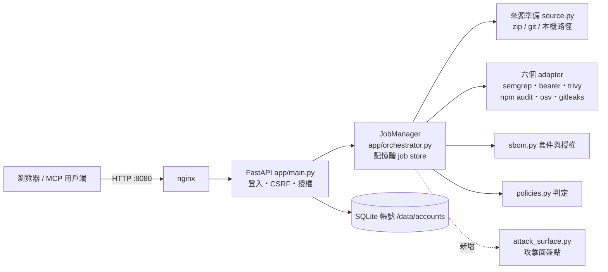
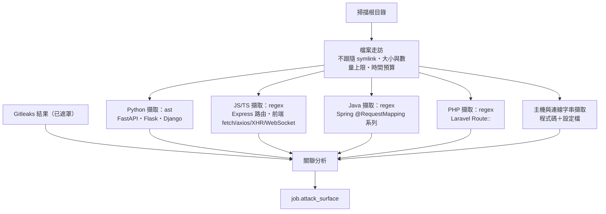

# 架構 — SAST Studio

> 架構唯一來源。任何架構變更先改本檔再改程式。本檔進版控，不寫入任何憑證。
> 本檔於第 43 輪建立；前 42 輪的架構散見 README 與 lessons.md，此處先整理現況總覽，再寫本輪新增的「攻擊面盤點」。

## 1. 現況總覽



| 層 | 技術 |
|---|---|
| 前端 | 單頁、原生 JS（`app/static/`），中英 i18n，不使用前端框架 |
| 後端 | Python FastAPI；掃描器以 `run_command`（list 參數、shell=False、timeout）呼叫 |
| 儲存 | 掃描結果在記憶體；帳號 SQLite；工作區每個 job 一個目錄，結束即刪 |
| 部署 | Docker Compose（sast-studio + nginx），`scripts/deploy.sh` |

**信任邊界**：被掃描的程式碼是**不可信資料**——只讀取、從不執行（npm 也只用 `--package-lock-only --ignore-scripts`）。這條在本輪維持不變。

## 2. 第 43 輪新增：攻擊面盤點（attack surface）

### 2.1 定位
回答「這份程式對外開了哪些門、連去哪裡」。**純靜態**：讀檔、解析，不執行被掃程式、不發任何網路請求。結果只供參考，**不影響判定**（talk.md #023，Q3a）。

### 2.2 模組與資料流


- 新檔 `app/attack_surface.py`，對外只有 `collect(scan_root, findings) -> dict`。
- 由 orchestrator 在 sbom 之後、清理工作區之前呼叫（每次掃描固定執行，Q1b）；失敗只讓本區塊標 `error`，**不影響掃描本身**。
- 不新增任何第三方相依：Python 用標準庫 `ast`、`re`、`ipaddress`。
- **與第 1 輪說明的差異**：原說用 Semgrep 自訂規則擷取路由，改為內建擷取器。理由：(1) 每次固定執行，不該依賴使用者有沒有勾 semgrep；(2) semgrep 有自身逾時與未完整的問題（第 41 輪）；(3) Python 的 `ast` 比 pattern 更準確地拿到裝飾器與 prefix；(4) 不啟動額外程序，快且可完整單元測試。

### 2.3 擷取範圍（第一版，Q2 a+b）
| 語言 | 後端路由 | 認證偵測（只回報「偵測到／未偵測到」，不斷言「沒有」） |
|---|---|---|
| Python | FastAPI `@app/@router.<method>`、`APIRouter(prefix=)`；Flask `@route`、`Blueprint(url_prefix=)`；Django `path()`/`re_path()` | `Depends(...)` 名稱含 auth/user/token/login、`@login_required`、`@jwt_required`、`LoginRequiredMixin` 等 |
| JS/TS | Express `app/router.<method>(...)`、同檔 `app.use('/prefix', router)` | 中介層名稱含 auth/jwt/passport/verifyToken/requireLogin |
| Java | Spring 類別層 `@RequestMapping` ＋ 方法層 `@Get/Post/Put/Delete/PatchMapping`、`@RequestMapping(method=)` | `@PreAuthorize`、`@Secured`、`@RolesAllowed` |
| PHP | Laravel `Route::get/post/...`、`Route::prefix()->group` | `->middleware('auth…')` |

前端呼叫：`fetch`、`axios`（含 `axios({url})`）、`$.ajax/$.get/$.post`、`XMLHttpRequest.open`、`new WebSocket`、`new EventSource`，加上 URL 字串常值與 `/api/` 開頭的路徑常值。樣板字串 `${x}` 轉為 `{param}`。

### 2.4 關聯分析與標記
- 路徑正規化：`{id}`、`:id`、`<int:id>`、`{param}` 一律視為同一個參數段。
- 端點標記：`no_auth_detected`（未偵測到認證）、`unreferenced`（後端有、前端沒呼叫）、`undocumented`（專案有 OpenAPI/Swagger 檔但未列）、`unknown_backend`（前端呼叫的路徑在後端找不到；僅在有偵測到後端路由時才標）。全部標為「推論，待人工確認」。
- 主機分類：內網 IP（RFC1918／loopback／link-local）、雲端中繼資料位址、雲端儲存（S3/GCS/Azure Blob/Firebase）、資料庫連線字串（mongodb/postgres/mysql/redis/amqp…，**帳密遮罩為 `***`**）、第三方。
- 風險項（前端直連不該連的服務）：前端檔案中出現內網 IP、資料庫連線字串、雲端中繼資料位址，或 Gitleaks 命中位於前端檔案。「前端檔案」以副檔名＋目錄名＋內容特徵判斷，屬啟發式，畫面明示。

### 2.5 資料結構（`Job.attack_surface`）
```json
{
  "status": "ok | incomplete | error",
  "reason": "…為何未完整…",
  "stats": {"files_scanned": 0, "files_skipped": 0, "frameworks": ["fastapi"]},
  "summary": {"endpoints": 0, "backend_routes": 0, "frontend_calls": 0,
              "no_auth": 0, "unreferenced": 0, "hosts": 0, "risks": 0, "secrets": 0},
  "endpoints": [{"method": "GET", "path": "/api/x", "side": "backend|frontend",
                 "framework": "fastapi", "file": "app/x.py", "line": 12,
                 "auth": "detected|not_detected|n/a", "flags": []}],
  "hosts": [{"host": "10.0.0.5", "category": "private", "frontend": true,
             "locations": [{"file": "web/a.js", "line": 3}]}],
  "secrets": [{"rule": "aws-access-key", "file": "web/a.js", "line": 9, "frontend": true}],
  "risks": [{"kind": "frontend_private_host", "file": "web/a.js", "line": 3, "detail": "10.0.0.5"}],
  "truncated": {"endpoints": 0, "hosts": 0}
}
```

### 2.6 介面
| 位置 | 內容 |
|---|---|
| REST | `GET /api/scans/{id}` 已含 `attack_surface`；新增 `GET /api/scans/{id}/attack-surface.json` 下載（沿用既有擁有者授權檢查） |
| MCP | `get_scan_result` 加 `attack_surface`：摘要＋前 50 筆風險與無認證端點 |
| 畫面 | 新分頁「攻擊面」：靜態限制說明 → 數字卡片 → 關聯圖／心智圖（手寫 SVG，可切換）→ 明細表；報告頁加「攻擊面摘要」卡片（含限制說明），因此匯出 PDF 會帶到 |

### 2.7 安全設計（本模組自身）
- 只讀不執行、不發網路請求；`os.walk(followlinks=False)` 並略過 symlink 檔案，路徑一律限制在掃描根目錄內。
- 上限：單檔 2 MB、最多 20,000 檔、單行只取前 20,000 字元、整體 60 秒預算；超過即 `incomplete` 並寫明原因（第 41 輪準則：沒看完不能說看完）。
- regex 只用有界字元類別、無巢狀量詞，避免 ReDoS；結果清單有上限並記錄截斷數。
- 不回傳原始密鑰：密鑰只引用 Gitleaks 已遮罩的結果；連線字串的帳密遮罩。
- 前端一律以 `textContent` 呈現。

## 3. 架構決策紀錄（ADR）
| # | 日期 | 決策 | 理由 |
|---|---|---|---|
| 1 | 2026-10-04 | 攻擊面盤點用內建 Python 擷取器，不用 Semgrep 規則 | 見 2.2 |
| 3 | 2026-10-04 | 圖表用手寫 SVG，不引入圖表函式庫 | CoreMain 原生 JS 原則；離線部署不能依賴 CDN；四欄固定版面不需要力導向演算法 |
| 2 | 2026-10-04 | 動態分析（HAR／log 匯入、ZAP）延後；本系統不執行被掃程式 | talk.md #023；信任邊界 |

## 4. 變更紀錄
- 2026-10-04：建立本檔；新增第 2 節攻擊面盤點。使用者同意 ADR-1（AST）；新增 ADR-3（SVG 圖表）與靜態限制說明（talk.md #024）。
