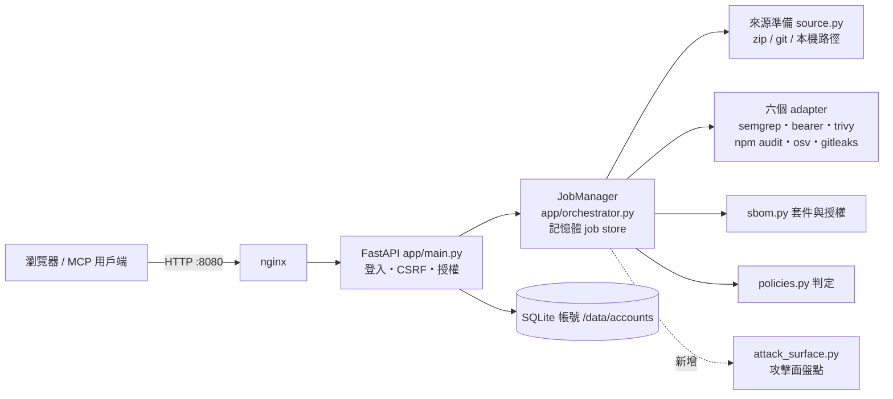
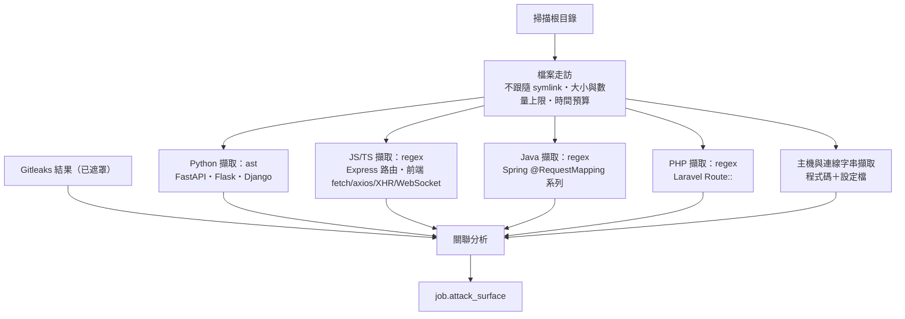
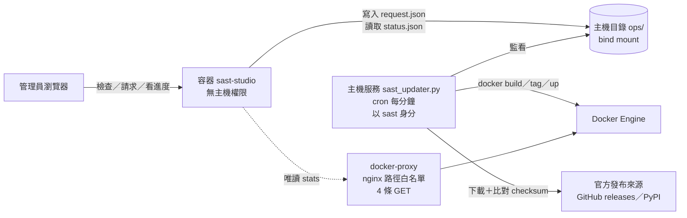

# 架構 — SAST Studio

> 架構唯一來源。任何架構變更先改本檔再改程式。本檔進版控，不寫入任何憑證。
> 本檔於第 43 輪建立；前 42 輪的架構散見 README 與 lessons.md，此處先整理現況總覽，再寫本輪新增的「攻擊面盤點」。

## 1. 現況總覽



| 層 | 技術 |
|---|---|
| 前端 | 單頁、原生 JS（`app/static/`），中英 i18n，不使用前端框架 |
| 後端 | Python FastAPI；掃描器以 `run_command`（list 參數、shell=False、timeout）呼叫 |
| 儲存 | 掃描結果在記憶體；帳號 SQLite；工作區每個 job 一個目錄，結束即刪 |
| 部署 | Docker Compose（sast-studio + nginx），`scripts/deploy.sh`；Semgrep 在映像內獨立 venv `/opt/semgrep`（ADR-5） |

**信任邊界**：被掃描的程式碼是**不可信資料**——只讀取、從不執行（npm 也只用 `--package-lock-only --ignore-scripts`）。這條在本輪維持不變。

## 2. 第 43 輪新增：攻擊面盤點（attack surface）

### 2.1 定位
回答「這份程式對外開了哪些門、連去哪裡」。**純靜態**：讀檔、解析，不執行被掃程式、不發任何網路請求。結果只供參考，**不影響判定**（talk.md #023，Q3a）。

### 2.2 模組與資料流


- 新檔 `app/attack_surface.py`，對外只有 `collect(scan_root, findings) -> dict`。
- 由 orchestrator 在 sbom 之後、清理工作區之前呼叫（每次掃描固定執行，Q1b）；失敗只讓本區塊標 `error`，**不影響掃描本身**。
- 不新增任何第三方相依：Python 用標準庫 `ast`、`re`、`ipaddress`。
- **與第 1 輪說明的差異**：原說用 Semgrep 自訂規則擷取路由，改為內建擷取器。理由：(1) 每次固定執行，不該依賴使用者有沒有勾 semgrep；(2) semgrep 有自身逾時與未完整的問題（第 41 輪）；(3) Python 的 `ast` 比 pattern 更準確地拿到裝飾器與 prefix；(4) 不啟動額外程序，快且可完整單元測試。

### 2.3 擷取範圍（第一版，Q2 a+b）
| 語言 | 後端路由 | 認證偵測（只回報「偵測到／未偵測到」，不斷言「沒有」） |
|---|---|---|
| Python | FastAPI `@app/@router.<method>`、`APIRouter(prefix=)`；Flask `@route`、`Blueprint(url_prefix=)`；Django `path()`/`re_path()` | `Depends(...)` 名稱含 auth/user/token/login、`@login_required`、`@jwt_required`、`LoginRequiredMixin` 等 |
| JS/TS | Express `app/router.<method>(...)`、同檔 `app.use('/prefix', router)` | 中介層名稱含 auth/jwt/passport/verifyToken/requireLogin |
| Java | Spring 類別層 `@RequestMapping` ＋ 方法層 `@Get/Post/Put/Delete/PatchMapping`、`@RequestMapping(method=)` | `@PreAuthorize`、`@Secured`、`@RolesAllowed` |
| PHP | Laravel `Route::get/post/...`、`Route::prefix()->group` | `->middleware('auth…')` |

前端呼叫：`fetch`、`axios`（含 `axios({url})`）、`$.ajax/$.get/$.post`、`XMLHttpRequest.open`、`new WebSocket`、`new EventSource`，加上 URL 字串常值與 `/api/` 開頭的路徑常值。樣板字串 `${x}` 轉為 `{param}`。

### 2.4 關聯分析與標記
- 路徑正規化：`{id}`、`:id`、`<int:id>`、`{param}` 一律視為同一個參數段。
- 端點標記：`no_auth_detected`（未偵測到認證）、`unreferenced`（後端有、前端沒呼叫）、`undocumented`（專案有 OpenAPI/Swagger 檔但未列）、`unknown_backend`（前端呼叫的路徑在後端找不到；僅在有偵測到後端路由時才標）。全部標為「推論，待人工確認」。
- 主機分類：內網 IP（RFC1918／loopback／link-local）、雲端中繼資料位址、雲端儲存（S3/GCS/Azure Blob/Firebase）、資料庫連線字串（mongodb/postgres/mysql/redis/amqp…，**帳密遮罩為 `***`**）、第三方。
- 風險項（前端直連不該連的服務）：前端檔案中出現內網 IP、資料庫連線字串、雲端中繼資料位址，或 Gitleaks 命中位於前端檔案。「前端檔案」以副檔名＋目錄名＋內容特徵判斷，屬啟發式，畫面明示。

### 2.5 資料結構（`Job.attack_surface`）
```json
{
  "status": "ok | incomplete | error",
  "reason": "…為何未完整…",
  "stats": {"files_scanned": 0, "files_skipped": 0, "frameworks": ["fastapi"]},
  "summary": {"endpoints": 0, "backend_routes": 0, "frontend_calls": 0,
              "no_auth": 0, "unreferenced": 0, "hosts": 0, "risks": 0, "secrets": 0},
  "endpoints": [{"method": "GET", "path": "/api/x", "side": "backend|frontend",
                 "framework": "fastapi", "file": "app/x.py", "line": 12,
                 "auth": "detected|not_detected|n/a", "flags": []}],
  "hosts": [{"host": "10.0.0.5", "category": "private", "frontend": true,
             "locations": [{"file": "web/a.js", "line": 3}]}],
  "secrets": [{"rule": "aws-access-key", "file": "web/a.js", "line": 9, "frontend": true}],
  "risks": [{"kind": "frontend_private_host", "file": "web/a.js", "line": 3, "detail": "10.0.0.5"}],
  "truncated": {"endpoints": 0, "hosts": 0}
}
```

### 2.6 介面
| 位置 | 內容 |
|---|---|
| REST | `GET /api/scans/{id}` 已含 `attack_surface`；新增 `GET /api/scans/{id}/attack-surface.json` 下載（沿用既有擁有者授權檢查） |
| MCP | `get_scan_result` 加 `attack_surface`：摘要＋前 50 筆風險與無認證端點 |
| 畫面 | 新分頁「攻擊面」：靜態限制說明 → 數字卡片 → 關聯圖／心智圖（手寫 SVG，可切換）→ 明細表；報告頁加「攻擊面摘要」卡片（含限制說明），因此匯出 PDF 會帶到 |

### 2.7 安全設計（本模組自身）
- 只讀不執行、不發網路請求；`os.walk(followlinks=False)` 並略過 symlink 檔案，路徑一律限制在掃描根目錄內。
- 上限：單檔 2 MB、最多 20,000 檔、整體 60 秒預算；超過即 `incomplete` 並寫明原因（第 41 輪準則：沒看完不能說看完）。不截斷單行——壓縮過的前端 bundle 整個檔案就是一行，截斷會漏掉端點；改為確保每個 regex 與比對都是線性（區段查找用 bisect；同檔重複呼叫只記一次）。實測 1 MB 單行檔 < 1 秒。
- regex 只用有界字元類別、無巢狀量詞，避免 ReDoS；結果清單有上限並記錄截斷數。
- 不回傳原始密鑰：密鑰只引用 Gitleaks 已遮罩的結果；連線字串的帳密遮罩。
- 前端一律以 `textContent` 呈現。

## 2A. 第 45 輪：網頁觸發的掃描工具升級（2026-10-05 使用者確認）

依 talk.md #027。目標：管理員在網頁按一個按鈕，就能檢查並升級需要重建映像的掃描工具，而網頁容器**仍然拿不到主機控制權**。

### 2A.1 元件與信任邊界



| 元件 | 能做什麼 | 不能做什麼 |
|---|---|---|
| 網頁容器 | 寫一筆請求（勾選的工具＋畫面顯示的目標版本）、讀狀態 | 執行任何主機指令；指定任意版本、分支或指令；直接存取 docker socket（改走唯讀 proxy） |
| 主機服務 | 依固定流程升級白名單內的工具 | 接受請求裡的指令或路徑；請求只當成「要升級哪幾個」的提示，版本自己重新查核 |
| `ops/` 目錄 | 只放 `request.json`、`status.json`、`update.log` | 不放憑證；主機服務把內容視為不可信輸入 |

**安全前提**：現在 compose 對 `/var/run/docker.sock` 用 `:ro` 掛載，但這**擋不住** Docker API 寫入（等同主機 root）。若不改，「網頁拿不到主機權限」就不成立，所以本輪一併把監控分頁改走 `docker-proxy`（nginx，`nginx/docker-proxy.conf`：只放行 `GET /containers/json`、`/containers/<id>/json`、`/containers/<id>/stats`、`/info`，其餘一律 403；不讀其他容器的檔案、log，不能寫入），app 容器不再掛 socket，也不再需要 docker 群組（`docker-gid.sh` 移除）。殘餘：`/containers/<id>/json` 仍可讀任一容器的設定（含環境變數），監控分頁讀記憶體上限需要它。

### 2A.2 升級流程（主機服務）

1. **讀取請求**：檢查格式；工具名稱必須在白名單（semgrep、trivy、osv_scanner、gitleaks；bearer 走官方安裝腳本，重建即更新）；同時只允許一個請求。
2. **重新查核版本**：自行查詢官方最新版本與發布時間；只接受**發布滿 7 天**的版本；必須等於請求上的目標版本（管理員看到什麼就裝什麼），不一致即拒絕。
3. **下載與驗證**：二進位工具比對官方 checksums 檔（osv `SHA256SUMS`、gitleaks／trivy `checksums.txt`）；Semgrep 由 PyPI 安裝指定版本（`semgrep==X`）。
4. **建置候選映像** `sast-studio:candidate`，版本以 build args 傳入；舊容器持續服務。
5. **自動驗收**（任何一項失敗即停止）：
   - 六個掃描器在候選映像內都能啟動（`deploy.sh` 同一段探測）；
   - **樣本專案**：內建一個刻意含漏洞的小專案，每個掃描器都必須抓到預期的發現（抓「能啟動但掃不到」）；需要的假密鑰在執行時才組出來，不放進 repo；
   - Trivy 掃候選映像，CRITICAL 數量不得多於目前映像。
6. **切換**：candidate 標成 latest → `compose up -d` → 健康檢查；失敗則標回原映像並重啟。
7. **記錄**：新版本寫入主機 `.env`（`SEMGREP_VERSION=…`），之後 `deploy.sh` 也沿用；`status.json` 記錄每一步結果；監控分頁提示「本機版本比 repo 新」。

### 2A.3 其他配套
- `deploy.sh`：`git pull` 後若自身有變，`exec` 新版並帶 `--no-pull`（修正第 44 輪發現的自我更新問題）；讀取 `.env` 中的版本覆寫。
- 網頁：監控分頁新增「檢查新版」「開始更新」，顯示每一步進度與失敗原因；僅管理員、CSRF、同時只能一個。
- 安裝：`scripts/install-updater.sh`（`setup.sh --docker` 會呼叫）建立 `ops/` 並加入 sast 使用者的 crontab，每分鐘執行一次；不需 sudo、不裝系統服務。主機服務與 `deploy.sh` 共用 `.updater.lock`。
- `ops/` 的防護：主機每次執行先清理——非預期名稱或非一般檔案（目錄、FIFO、symlink）一律刪除，預期檔案去掉 setuid／執行權限；讀取一律 O_NOFOLLOW＋O_NONBLOCK＋大小上限，寫入一律「寫暫存檔再 rename」。
- 回退映像：`scripts/prune-rollbacks.sh` 依映像（非 tag）計算，只保留目前版本與前一版（2026-10-07 由 3 個改為 1 個回退，talk.md #029），`deploy.sh` 與升級成功後都呼叫。
- 建置內容：`.dockerignore` 只放行 `app/`、`vendor/`、`requirements.txt`。
- 非 Docker 的主機安裝模式不提供此按鈕（沿用 `setup.sh --update`）。

### 2A.4 使用者決定（2026-10-05）
1. 有掃描進行中：**等掃描結束再切換**——驗收通過後進入「等待掃描」，網頁暫停接受新掃描，進行中的全部結束才切換；等待上限 60 分鐘，逾時則放棄本次升級並恢復接受掃描。
2. 以 Trivy 0.75.0 作為新流程的第一個實測（G6；須已發布滿 7 天）。

## 2B. 第 46 輪：攻擊面準確度與 proxy 收斂（2026-10-06，talk.md #028）

### 2B.1 測試／範例來源
- 判定（`is_sample`）：路徑中任一層為 `test`、`tests`、`__tests__`、`spec`、`specs`、`docs`、`doc`、`mockup(s)`、`example(s)`、`fixtures`、`testdata`，或檔名為 `test_*.py`、`*_test.*`、`*.test.*`、`*.spec.*`；另可用 `SAST_SURFACE_SAMPLE_PATHS`（逗號分隔路徑前綴）加入。
- 處理：項目照樣列出並標 `sample: true`，但**不計入**摘要數字、風險、無人呼叫判斷與關聯圖；測試檔裡的呼叫不算「有人呼叫」。畫面可切換顯示。摘要另給 `samples` 數量。
### 2B.2 全域認證（推論）
- FastAPI／Starlette：`@app.middleware("http")` 的函式內有 401／403 回應，或 `FastAPI(dependencies=[Depends(...)])` → 專案所有 FastAPI 路由標 `auth: "global"`（推論，非 `no_auth_detected`）。
- 公開路徑：中介層內「賦值目標或引用的模組層集合名稱」含 public／allow／exempt／anonymous／open／skip 的判斷式中，`==`／`in` 的字串視為公開路徑、`startswith` 視為公開前綴 → 這些路由標 `auth: "public"`。僅記錄、刪除用的判斷（例如只寫 log 的 `"/api/"`）不會被誤當公開。
- 仍為推論，畫面標示；不影響判定。
### 2B.3 docker-proxy 只放行本專案容器
- compose 指定 `container_name`（sast-studio、sast-nginx、sast-docker-proxy；不改專案名稱，具名 volume 不受影響）。
- proxy 白名單改為：`GET /containers/json`、`/info`，以及**這三個名稱**的 `/json`、`/stats`；以 id 或其他名稱查詢一律 403。監控改以名稱查詢。殘餘：容器清單本身（名稱、映像）。
### 2B.4 抑制註解
- 既有 38 處：能改具體例外者改寫；屬「最後一道防線」者保留 `except Exception`，移除 `noqa` 改為一般註解說明；`S603`／`SLF001` 改寫或改為說明註解。

## 3. 架構決策紀錄（ADR）
| # | 日期 | 決策 | 理由 |
|---|---|---|---|
| 1 | 2026-10-04 | 攻擊面盤點用內建 Python 擷取器，不用 Semgrep 規則 | 見 2.2 |
| 4 | 2026-10-04 | 關聯圖改五欄左右對稱，外部主機與所屬程式同列 | 使用者要求連線接在所屬程式後面（talk.md #025） |
| 3 | 2026-10-04 | 圖表用手寫 SVG，不引入圖表函式庫 | CoreMain 原生 JS 原則；離線部署不能依賴 CDN；四欄固定版面不需要力導向演算法 |
| 2 | 2026-10-04 | 動態分析（HAR／log 匯入、ZAP）延後；本系統不執行被掃程式 | talk.md #023；信任邊界 |
| 6 | 2026-10-05 | 掃描工具升級由網頁觸發、主機服務自動驗收後切換，不經 CI；修改 ADR-5「升級需經 CI」 | 使用者要求網頁一鍵升級（talk.md #027）；以 checksum、7 天冷卻、樣本掃描、映像 CRITICAL 比對取代 CI 把關 |
| 8 | 2026-10-06 | 攻擊面區分測試／範例來源、推論全域認證；proxy 只放行本專案容器名稱 | 掃描本專案時大量範例 IP 與「無認證」誤判（talk.md #028） |
| 7 | 2026-10-05 | app 容器不再掛 docker socket，監控改經唯讀 proxy | `:ro` 擋不住 Docker API 寫入；ADR-6 的安全前提 |
| 5 | 2026-10-05 | Semgrep 裝在獨立 venv（映像、主機安裝、CI 皆同），不與程式共用 Python 環境；建置與部署（切換前）都直接確認六個掃描器能啟動；Semgrep 釘版本、venv 由 root 擁有，網頁不再就地升級，改為重建映像 | FastAPI 0.142 與 semgrep 對 opentelemetry-api 的要求互斥，同一環境必壞一邊；不採釘 FastAPI 版本，因 requirements 只設下限（talk.md #026） |

## 4. 變更紀錄
- 2026-10-06：新增 §2B（第 46 輪）、ADR-8。
- 2026-10-05：新增 §2A（第 45 輪，網頁觸發升級）、ADR-6、ADR-7（talk.md #027）。
- 2026-10-05：ADR-5：Semgrep 改為獨立 venv、釘版本、不再就地升級；部署在切換前於新映像內探測六個掃描器（talk.md #026）。
- 2026-10-04：G3 複核後修訂 2.7：帳密遮罩改以最後一個 @ 為界並套用到前端呼叫網址；檔案內每個比對迴圈都檢查時間預算；Java／PHP／YAML 擷取改為線性；以 O_NOFOLLOW|O_NONBLOCK 開檔並確認是一般檔案。關聯圖改五欄（ADR-4）。
- 2026-10-04：實作後修訂 2.7：移除「單行截斷」，改為線性比對（見測試 `test_minified_bundle_on_one_line_is_fast`）；可見分頁加入一般使用者（只看得到自己的掃描）。
- 2026-10-04：建立本檔；新增第 2 節攻擊面盤點。使用者同意 ADR-1（AST）；新增 ADR-3（SVG 圖表）與靜態限制說明（talk.md #024）。
